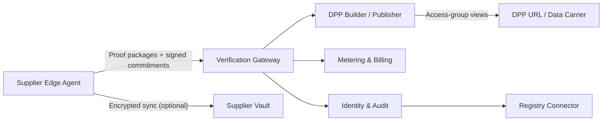
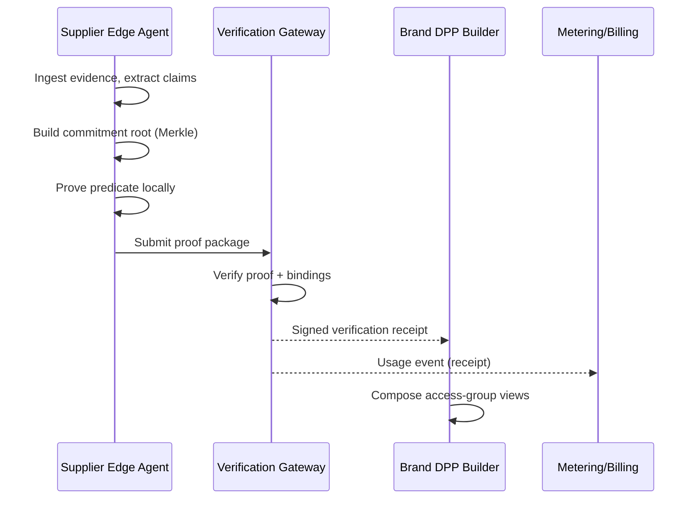
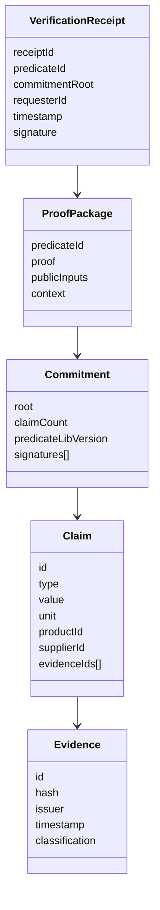
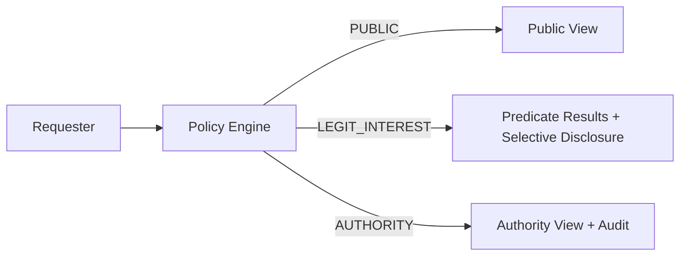
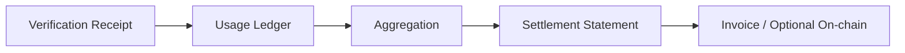
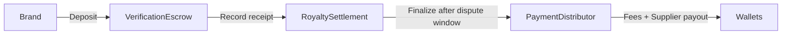

# ZK‑DPP Royalty Protocol

[](https://github.com/hadijannat/zk-dpp-royalty-protocol/actions/workflows/ci.yml)
[](https://github.com/hadijannat/zk-dpp-royalty-protocol/releases)
[](LICENSE)

A compliance‑grade, privacy‑preserving toolchain for Digital Product Passports (DPP) that enables **selective disclosure** via ZK predicates and **usage‑based data royalties** without exposing supplier trade secrets.

---

## Why this exists

Digital Product Passports require deep, verifiable supply‑chain data. Suppliers cannot disclose proprietary recipes, upstream relationships, or pricing. This system resolves the conflict by letting suppliers **commit to structured claims locally** and respond to **fixed compliance predicates** using zero‑knowledge proofs or selective disclosure—while brands and regulators can still verify compliance.

---

## System architecture (high level)



---

## Core components

- **Edge Agent (Tauri)**: local document ingest, extraction, review, evidence hashing, commitments, and ZK proof generation.
- **Predicate Library (Noir)**: versioned predicate circuits (e.g., recycled content threshold, substances not in list).
- **Verification Gateway**: verifies proof packages and issues signed verification receipts.
- **DPP Builder**: composes public/legitimate‑interest/authority views from verified receipts.
- **Metering & Billing**: usage receipts → aggregation → settlement statements.
- **Identity & Audit**: issuer attestations, revocation lists, and access‑log integrity.
- **Registry Connector**: prepares compliance metadata for external registries.

---

## Protocol lifecycle (end‑to‑end)



---

## Data model (canonical objects)



---

## Cryptography & proof design

### Commitment model

- **Leaf hash**: BLAKE3 over canonical claim components.
- **Merkle tree**: BLAKE3 node hashing (left || right).
- **Commitment root**: signed by supplier key.

### Predicate proofs

Each proof binds to:

- Commitment root
- Product binding (SKU/batch/item)
- Requester binding (brand/authority)
- Validity window + nonce

This prevents replay and cross‑customer leakage.

---

## Access control model (ABAC/RBAC)



---

## Metering & royalties

The system monetizes **verification events**, not QR scans.



---

## Smart contracts (on‑chain settlement)

The on‑chain layer is optional and is designed for **enterprise‑friendly settlement** with a dispute window and explicit fee splits.

### Contract set

- **RoyaltySettlement.sol** — settlement statements with dispute window
- **VerificationEscrow.sol** — brand deposits + receipt tracking
- **PaymentDistributor.sol** — fee splits (protocol + gateway + supplier)
- **MockUSDC.sol** — 6‑decimals test token

### On‑chain flow



### Foundry quickstart

```bash
pnpm contracts:build
pnpm contracts:test
pnpm contracts:deploy:sepolia
```

---

## Scientific/engineering principles

- **Truth vs. Proof**: cryptographic proofs verify statements about committed data, not truth. This system binds claims to evidence and supports attestation + revocation.
- **Inference resistance**: only a fixed predicate library is supported; arbitrary ad‑hoc queries are rejected.
- **Separation of duties**: edge agent produces proofs; gateway verifies; builder publishes views; metering is independent.

---

## Repository layout (core)

```
apps/                 Edge agent and UI apps
services/             Gateway, DPP builder, metering, identity
crates/               Rust libraries (commitments, crypto, policy)
circuits/             Noir predicate circuits
packages/             Schemas and SDKs
packages/contracts/   TypeScript client for on‑chain interactions
contracts/            Foundry contracts + tests + scripts
```

---

## Quickstart

### Prerequisites

- Node.js >= 20
- pnpm >= 8
- Rust (stable)
- Noir toolchain (`nargo`)

### Install

```bash
pnpm install
```

### Rust build

```bash
pnpm rust:build
```

### Noir circuits test

```bash
pnpm circuits:test
```

If `nargo` is not installed:

```bash
curl -L https://raw.githubusercontent.com/noir-lang/noirup/main/install | bash
noirup
```

---

## Documentation

### Getting Started
- **[Quickstart Guide](docs/developer/quickstart.md)** — Get running in 5 minutes
- **[Local Setup](docs/developer/local-setup.md)** — Full development environment

### Architecture & Concepts
- **[Architecture Overview](docs/developer/architecture.md)** — System design deep dive
- **[Core Concepts](docs/developer/concepts.md)** — DPP, predicates, commitments explained
- **[Testing Guide](docs/developer/testing.md)** — Running and writing tests

### API Reference
- **[OpenAPI Specification](docs/api/openapi.yaml)** — Full API spec
- **Swagger UI** (when running locally):
  - Verify Gateway: http://localhost:3001/docs
  - DPP Builder: http://localhost:3002/docs
  - Metering & Billing: http://localhost:3003/docs

### Deployment
- **[Docker Deployment](docs/deployment/docker.md)** — Docker Compose setup
- **[Kubernetes Deployment](docs/deployment/kubernetes.md)** — Helm chart installation
- **[Configuration Reference](docs/deployment/configuration.md)** — Environment variables
- **[Security Best Practices](docs/deployment/security.md)** — Hardening guide

### Architecture Decision Records (ADRs)
| ADR | Title |
|-----|-------|
| [001](docs/adr/001-noir-for-zk-proofs.md) | Noir for Zero-Knowledge Proofs |
| [002](docs/adr/002-fastify-as-http-framework.md) | Fastify as HTTP Framework |
| [003](docs/adr/003-base-l2-for-settlement.md) | Base L2 for Settlement Layer |
| [004](docs/adr/004-nats-jetstream-event-bus.md) | NATS JetStream as Event Bus |
| [005](docs/adr/005-keycloak-identity-provider.md) | Keycloak as Identity Provider |
| [006](docs/adr/006-tiered-access-model.md) | Tiered Access Model |
| [007](docs/adr/007-off-chain-first-settlement.md) | Off-Chain-First Settlement |
| [008](docs/adr/008-predicate-library-design.md) | Predicate Library Design |

---

## Security notes

- Local evidence stays on device by default.
- Proof packages contain only public inputs and proof bytes.
- Commitments are signed; receipts are signed by the gateway.

See `SECURITY.md` for reporting.

---

## License

Dual‑licensed under **Apache‑2.0 OR MIT**. See `LICENSE`, `LICENSE‑APACHE`, `LICENSE‑MIT`.
