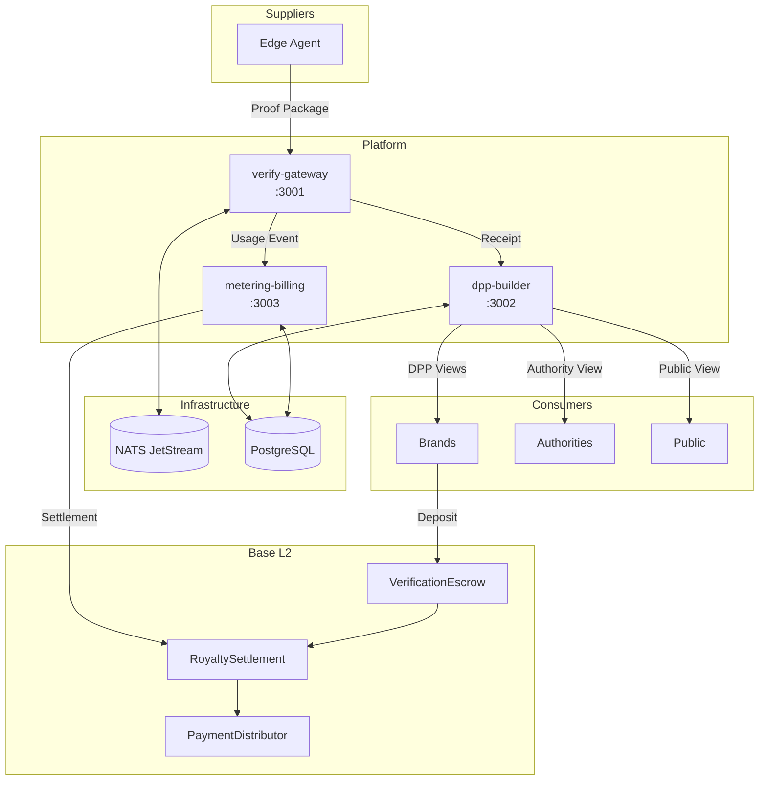
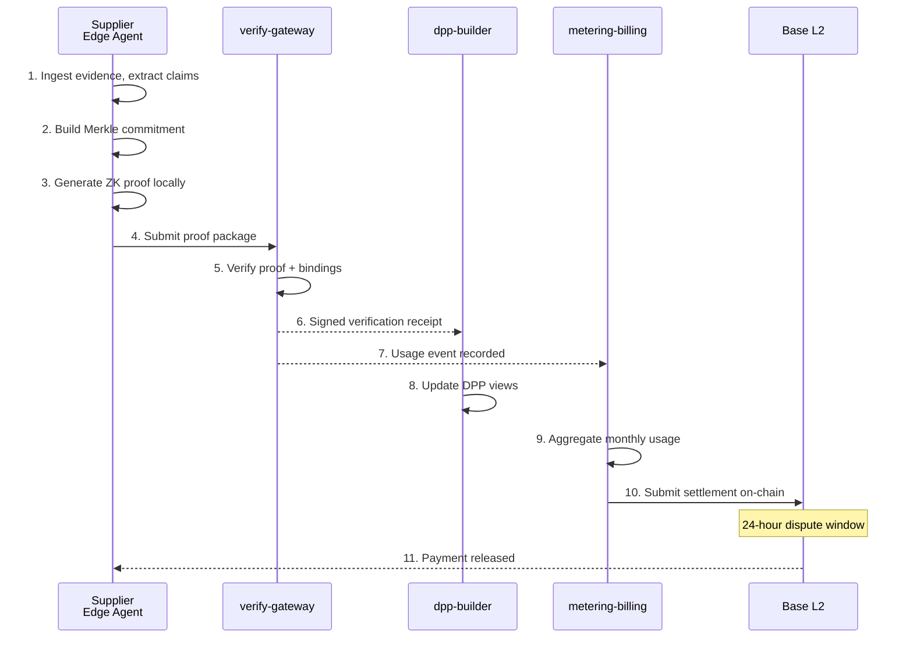

<div align="center">

# ZK-DPP Royalty Protocol

**Privacy-preserving Digital Product Passports with usage-based data royalties**

[](https://github.com/hadijannat/zk-dpp-royalty-protocol/actions/workflows/ci.yml)
[](https://github.com/hadijannat/zk-dpp-royalty-protocol/actions/workflows/build.yml)
[](https://github.com/hadijannat/zk-dpp-royalty-protocol/releases)
[](LICENSE)


[Quick Start](#quick-start) | [Documentation](docs/) | [API Reference](#api-reference) | [Architecture](#architecture)

</div>

---

## Why ZK-DPP?

Digital Product Passports require deep supply chain data for EU compliance. Suppliers cannot disclose proprietary recipes, upstream relationships, or pricing. **ZK-DPP resolves this conflict**: suppliers commit to structured claims locally and respond to fixed compliance predicates using zero-knowledge proofs. Brands and regulators verify compliance without seeing sensitive data. Suppliers earn royalties for each verification.

---

## Key Features

| Feature | Description |
|---------|-------------|
| **Zero-Knowledge Proofs** | Verify compliance without exposing sensitive supplier data |
| **13 Built-in Predicates** | Battery, environmental, and compliance verification circuits |
| **Usage-Based Royalties** | Suppliers monetize verification events, not data access |
| **Tiered Access Control** | PUBLIC / LEGIT_INTEREST / AUTHORITY view separation |
| **Base L2 Settlement** | On-chain royalty payments with 24-hour dispute window |
| **Event-Driven Architecture** | NATS JetStream for reliable async processing |

---

## Architecture



---

## Quick Start

### Prerequisites

- Node.js 20+
- pnpm 8+
- Docker & Docker Compose
- Rust (stable)
- Noir toolchain (`nargo`)

### 5-Minute Setup

```bash
# Clone and install
git clone https://github.com/hadijannat/zk-dpp-royalty-protocol.git
cd zk-dpp-royalty-protocol
pnpm install && pnpm build

# Start infrastructure
docker compose -f infra/docker/docker-compose.dev.yml up -d

# Start services
pnpm dev:services

# Verify health
curl http://localhost:3001/health
curl http://localhost:3002/health
curl http://localhost:3003/health
```

<details>
<summary><strong>Install Noir toolchain</strong></summary>

```bash
curl -L https://raw.githubusercontent.com/noir-lang/noirup/main/install | bash
noirup --version 0.30.0
```

</details>

---

## Project Structure

```
zk-dpp-royalty-protocol/
├── services/               # 3 TypeScript microservices
│   ├── verify-gateway/     # ZK proof verification, predicate discovery
│   ├── dpp-builder/        # Product management, DPP views, RBAC
│   └── metering-billing/   # Usage tracking, settlements, blockchain
├── packages/               # 6 shared TypeScript packages
│   ├── schemas/            # AJV validators for protocol objects
│   ├── event-bus/          # NATS JetStream messaging
│   ├── predicate-lib/      # 13 predicates + circuit generator
│   ├── shared/             # Logging, metrics, auth, rate limiting
│   ├── contracts/          # TypeScript client for Base L2
│   └── auth-client/        # Keycloak client wrapper
├── circuits/noir/          # 13 ZK predicate circuits
├── crates/                 # 3 Rust cryptographic crates
│   ├── commitments/        # Merkle tree, claim hashing
│   ├── crypto/             # Ed25519 keys, signatures
│   └── zkp-core/           # Proof verification (WASM)
├── contracts/              # 3 Solidity contracts (Base L2)
├── infra/                  # Docker & Helm deployment
│   ├── docker/             # Development compose files
│   └── helm/               # Kubernetes charts
└── docs/                   # Comprehensive documentation
```

---

## Components

### Services

| Service | Port | Purpose |
|---------|------|---------|
| **verify-gateway** | 3001 | ZK proof verification, predicate discovery, receipt issuance |
| **dpp-builder** | 3002 | Product CRUD, supplier linking, tiered DPP views |
| **metering-billing** | 3003 | Usage aggregation, settlement statements, blockchain integration |

### Packages

| Package | Purpose |
|---------|---------|
| **schemas** | JSON Schema definitions with AJV validators |
| **event-bus** | NATS JetStream client with typed events |
| **predicate-lib** | Predicate registry, circuit metadata, proof generation helpers |
| **shared** | Pino logging, Prometheus metrics, JWT auth, rate limiting |
| **contracts** | ethers.js client for Base L2 smart contracts |
| **auth-client** | Keycloak OIDC integration |

### ZK Predicates

<details>
<summary><strong>13 Built-in Predicates</strong></summary>

#### Compliance

| Predicate | Description |
|-----------|-------------|
| `CERT_VALID_V1` | Certificate not expired at verification time |
| `DUE_DILIGENCE_VALID_V1` | Supply chain due diligence certification |
| `COBALT_ORIGIN_NOT_IN_V1` | Cobalt origin not in conflict regions |

#### Battery

| Predicate | Description |
|-----------|-------------|
| `BATTERY_CAPACITY_GTE_V1` | Battery capacity >= threshold (Wh) |
| `BATTERY_CHEMISTRY_IN_SET_V1` | Chemistry in allowed set (LFP, NMC, etc.) |
| `ENERGY_DENSITY_RANGE_V1` | Energy density within range (Wh/kg) |
| `STATE_OF_HEALTH_GTE_V1` | Battery SOH >= threshold (%) |

#### Environmental

| Predicate | Description |
|-----------|-------------|
| `RECYCLED_CONTENT_GTE_V1` | Recycled content >= threshold (%) |
| `CARBON_FOOTPRINT_LTE_V1` | Carbon footprint <= threshold (kg CO2e) |
| `CARBON_FOOTPRINT_LIFECYCLE_V1` | Lifecycle emissions <= threshold |
| `RECYCLING_EFFICIENCY_GTE_V1` | Recycling efficiency >= threshold (%) |

#### Substances

| Predicate | Description |
|-----------|-------------|
| `SUBSTANCE_NOT_IN_LIST_V1` | Substance not in restricted list |

</details>

### Smart Contracts

| Contract | Address | Purpose |
|----------|---------|---------|
| **VerificationEscrow** | Base L2 | Brand USDC deposits for verification fees |
| **RoyaltySettlement** | Base L2 | 24-hour dispute window, supplier balance accumulation |
| **PaymentDistributor** | Base L2 | Fee splitting (2% protocol + 0.5% gateway) |

---

## Protocol Flow



---

## Development

### Build Commands

```bash
# TypeScript (all packages + services)
pnpm build
pnpm dev:services          # Start all services with hot reload

# Rust crates
cargo build --workspace
cargo test --workspace

# Noir circuits
pnpm circuits:compile      # Compile all predicates
pnpm circuits:test         # Run circuit tests

# Smart contracts (Foundry)
pnpm contracts:build
pnpm contracts:test
```

### Testing

```bash
# Full test suite
pnpm test                  # TypeScript unit + integration
cargo test --workspace     # Rust crates
pnpm circuits:test         # Noir circuits
pnpm contracts:test        # Solidity contracts

# With coverage
pnpm test:coverage
```

### Linting & Type Checking

```bash
pnpm lint
pnpm typecheck
cargo clippy --workspace
```

---

## Deployment

### Docker (Development)

```bash
# Start full stack
docker compose -f infra/docker/docker-compose.dev.yml up -d

# View logs
docker compose -f infra/docker/docker-compose.dev.yml logs -f

# Stop
docker compose -f infra/docker/docker-compose.dev.yml down
```

### Kubernetes (Production)

```bash
# Install with Helm
helm upgrade --install zkdpp ./infra/helm/zkdpp \
  --namespace zkdpp \
  --create-namespace \
  --values ./infra/helm/zkdpp/values-production.yaml

# Verify deployment
kubectl -n zkdpp get pods
kubectl -n zkdpp rollout status deployment/zkdpp-verify-gateway
```

See [Deployment Documentation](docs/deployment/) for detailed guides.

---

## API Reference

### Swagger UI (Local Development)

| Service | URL |
|---------|-----|
| verify-gateway | http://localhost:3001/docs |
| dpp-builder | http://localhost:3002/docs |
| metering-billing | http://localhost:3003/docs |

### OpenAPI Specification

Full API specification: [`docs/api/openapi.yaml`](docs/api/openapi.yaml)

### Key Endpoints

```bash
# Verify a proof
POST /verify
curl -X POST http://localhost:3001/verify \
  -H "Content-Type: application/json" \
  -d '{"predicateId": {...}, "proof": "...", "publicInputs": {...}}'

# Get available predicates
GET /predicates
curl http://localhost:3001/predicates

# Get DPP views
GET /dpp/:id/view/:accessLevel
curl http://localhost:3002/dpp/prod-123/view/public
```

---

## Documentation

| Category | Links |
|----------|-------|
| **Getting Started** | [Quickstart](docs/developer/quickstart.md) · [Local Setup](docs/developer/local-setup.md) |
| **Architecture** | [Overview](docs/developer/architecture.md) · [Concepts](docs/developer/concepts.md) |
| **Deployment** | [Docker](docs/deployment/docker.md) · [Kubernetes](docs/deployment/kubernetes.md) · [Configuration](docs/deployment/configuration.md) |
| **Security** | [Security Guide](docs/deployment/security.md) · [SECURITY.md](SECURITY.md) |

### Architecture Decision Records

| ADR | Decision |
|-----|----------|
| [001](docs/adr/001-noir-for-zk-proofs.md) | Noir for Zero-Knowledge Proofs |
| [002](docs/adr/002-fastify-as-http-framework.md) | Fastify as HTTP Framework |
| [003](docs/adr/003-base-l2-for-settlement.md) | Base L2 for Settlement Layer |
| [004](docs/adr/004-nats-jetstream-event-bus.md) | NATS JetStream as Event Bus |
| [005](docs/adr/005-keycloak-identity-provider.md) | Keycloak as Identity Provider |
| [006](docs/adr/006-tiered-access-model.md) | Tiered Access Model |
| [007](docs/adr/007-off-chain-first-settlement.md) | Off-Chain-First Settlement |
| [008](docs/adr/008-predicate-library-design.md) | Predicate Library Design |

---

## Contributing

See [CONTRIBUTING.md](CONTRIBUTING.md) for development guidelines.

1. Fork the repository
2. Create a feature branch (`git checkout -b feature/amazing-feature`)
3. Commit changes (`git commit -m 'Add amazing feature'`)
4. Push to branch (`git push origin feature/amazing-feature`)
5. Open a Pull Request

---

## Security

For security vulnerabilities, please see [SECURITY.md](SECURITY.md) or email security@example.com.

**Key security properties:**
- Local evidence stays on device by default
- Proof packages contain only public inputs and proof bytes
- Commitments signed by supplier; receipts signed by gateway
- 24-hour dispute window for on-chain settlements

---

## License

Dual-licensed under **Apache-2.0 OR MIT** at your option.

See [LICENSE](LICENSE), [LICENSE-APACHE](LICENSE-APACHE), [LICENSE-MIT](LICENSE-MIT).

---

<div align="center">

**[Documentation](docs/)** · **[Report Bug](https://github.com/hadijannat/zk-dpp-royalty-protocol/issues)** · **[Request Feature](https://github.com/hadijannat/zk-dpp-royalty-protocol/issues)**

</div>
